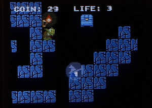

 
# The Lord Of The Fake Ring
The Lord Of The Fake Ring is an ESP32-based platform game where you get to play as a little wizard who's just been dropped to Middle-Earth. The purpose of the game is to retrieve the 'fake ring' from the depth of the Moria. 
A fully detailed explanation of the project can be found <a href="https://valentinbetbeze.com/platform_game.html" target="_blank">here</a>.

## Requirements
### Hardware
To play the game, the following hardware is needed:
<ul>
    <li><b>x2</b> ESP32-WROOM-32</li>
    <li><b>x1</b> 1.8 inch 128x160 SPI LCD display</li>
    <li><b>x1</b> 3.3V piezoelectric buzzer (optional)</li>
    <li><b>x1</b> Funduino Joystick Shield V1.A</li>
    <li><b>x1</b> Breadboard</li>
    <li><b>x2</b> micro-B(M) / A USB cables</li>
    <li> Jumper cables or Dupont wires (jumper wires are more reliable)</li>
</ul>

### Software
> **Warning** 
> Make sure the ESP-IDF folder is added to your environment variables (Windows).

The <b>ESP-IDF framework</b> is necessary to build the firmware's object files. See <a href="https://docs.espressif.com/projects/esp-idf/en/latest/esp32/get-started/" targer="_blank">Get Started</a> from Espressif. This step is mandatory to build and run any firmware on ESP32. 

## Hardware installation procedure
> **Note** 
> Clarification on some terms. The "console" is the part of the system where the game runs. It's made of an ESP32, the LCD display, and the buzzer. The "controller" is the part of the system dealing with the user's input. It's made of an ESP32 and the joystick shield. 

> **Note** 
> It does not matter which ESP32 is used for the console or the controller. 

### Console
<ol>
    <li>Connect the LCD display to one of the ESP32:</li>
    <ul>
        <li>SCL to GPIO 18</li>
        <li>SDA to GPIO 23</li>
        <li>CS to GPIO 5</li>
        <li>RES to GPIO 2</li>
        <li>DC to GPIO 15</li>
        <li>BKL to GPIO 17</li>
        <li>VCC to 3V3</li>
        <li>GND to GND</li>
    </ul>
    <li>Connect the Buzzer to one of the ESP32:</li>
    <ul>
        <li>I/O to GPIO 26</li>
        <li>VCC to 3V3</li>
        <li>GND to GND (different GND than the display's)</li>
    </ul>
    <li>Connect the ESP32 to your PC via USB</li>
    <li>Remember the COM port used</li>
</ol>

### Controller
<ol>
    <li>Make sure the switch on the bottom left side of the joystick shield is set to 3V3.</li>
    <li>Connect the joystick shield to the other ESP32:</li>
    <ul>
        <li>A to GPIO 21</li>
        <li>C to GPIO 5</li>
        <li>X to GPIO 4</li>
        <li>V to 3V3</li>
        <li>GND to GND</li>
    </ul>
    <li>Connect the ESP32 to your PC via USB</li>
    <li>Remember the COM port used</li>
</ol>

## Software installation procedure
> **Note** 
> I recommend to clone the repository via Git. However, if you decide to manually download the .zip file of the code, you can directly go to step 3. 

> **Warning** 
> If you download the .zip file, you will have to shorten the top folder's name to avoid compilation error. 

<ol>
    <li>Open Git from the folder in which you want to clone the repository.</li>
    <li>Clone the repository with <code>git clone https://github.com/valentinbetbeze/TheLordOfTheFakeRing.git</code></li>
    <li>Open the ESP-IDF CMD/Powershell and navigate to the repository folder.</li>
    <li>Go to the <b>controller's folder.</b></li>
    <li>Build and flash the application with <code>idf.py flash -p COM{port_number}</code> replacing "{port_number}" with the <i>controller</i>'s COM port number.</li>
    <li>Once the build is complete and flashed, go to the <b>console's folder.</b></li>
    <li>Run the application with <code>idf.py flash -p COM{port_number}</code> replacing "{port_number}" with the <i>console</i>'s USB port number.</li>
    <li>You can start playing.</li>
    <li>To start over, push the RST button on the console's ESP32. Warning: all progress will be lost!</li>
</ol>
